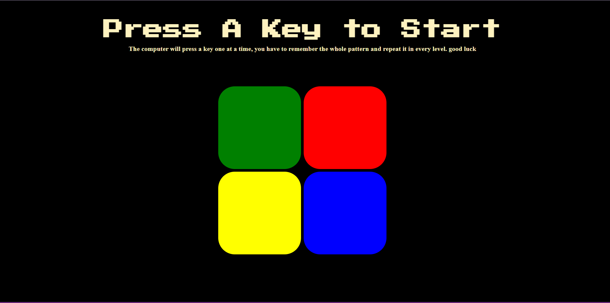
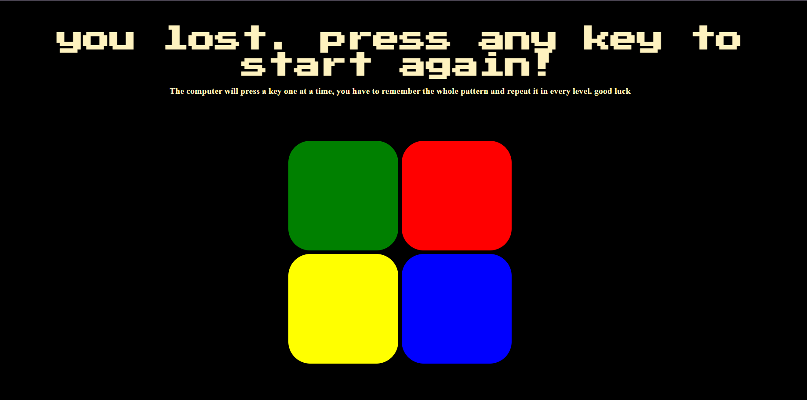

# Simon Game  🎵🟢🔴🟡🔵

The Simon Game is a classic memory game where players must remember and replicate increasingly complex sequences of lights and sounds. The game consists of four colored buttons, each producing a distinct tone when pressed. The game starts with one random button lighting up and playing its tone. The player must then press the same button. With each successful round, the game adds another random button to the sequence, and the player must remember and reproduce the entire sequence in the correct order. The game continues until the player makes a mistake or successfully completes all the rounds.

## Features

- Interactive Gameplay: The game provides an engaging experience by challenging the player's memory and concentration.
- Increasing Difficulty: With each round, the sequence length increases, making the game progressively harder.
- Visual and Audio Cues: Each button produces a unique tone and lights up, aiding the player in memorizing the sequence.
- Responsive Design: The game is designed to work on both desktop and mobile devices, ensuring a smooth user experience across different platforms.

## Screenshots

## How to play

1. Press the "Start" button to begin the game.
2. Watch and listen as a button lights up and plays a tone.
3. Repeat the sequence by pressing the buttons in the correct order.
4. Each round, the game will add another button to the sequence.
5. Continue repeating the sequence until you make a mistake or complete all rounds.
6. Try to achieve the highest score by remembering the longest sequence possible.
## Technologies used

* HTML: For structuring the game interface.
* CSS: For styling the game elements.
* JavaScript: For implementing the game logic and interactivity.
## Contributing

Contributions are always welcome!

If you’d like to contribute or use this project as a base for your own projects, you can fork the repository:

1. Click the "Fork" button at the top-right corner of this page.
2. Clone your forked repository to your local machine:

git clone https://github.com/divyaaa-13/Simon-Game.git

3. Create a new branch for your changes:
  git checkout -b my-new-feature

4. Make your changes and commit them:
 git commit -am 'Add some feature'

5. Push the branch to your repository:
 git push origin my-new-feature

6. Open a pull request to this repository with a description of your changes.

